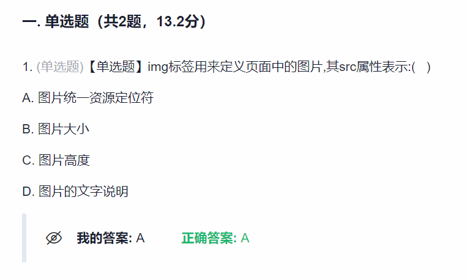

# 学习通复习显示隐藏答案 HideShowChaoXingAnwer
## 作用
隐藏/显示作业详情页的答案，用于自己期末做题测试复习效果。思考之后再看正确答案。

    

## 使用方法
通过单击键盘左上方的 <kbd>~</kbd> 键来隐藏/显示正确答案，用于期末复习

## 快速安装
[📦v1.0 点我安装⬇️（GreasyFork）](https://update.greasyfork.org/scripts/483510.user.js)

[📦v1.0 点我安装⬇️（脚本猫）](https://scriptcat.org/scripts/code/1460/%E8%B6%85%E6%98%9F%E9%9A%90%E8%97%8F%E6%98%BE%E7%A4%BA%E6%AD%A3%E7%A1%AE%E7%AD%94%E6%A1%88.user.js)

## 没人想看的更新日志
**Version: 1.2.0**
1. 增加了遮罩层用于显示答案状态
2. 增加了通过图标点按显示隐藏答案
3. 增加了“点击'答案已隐藏'之后显示答案”的功能，不再只通过按键恢复。
4. 增加了“将分数和对错状态也一起隐藏”的功能
5. 修复了用鼠标拖动可以查看反色文字的bug
6. 修改了显示原理：修改文字div的display、添加遮罩层
7. 修改了README中的效果图

**Version: 1.1.0**
1. 更新了显示原理为：修改字体颜色为transparent，以免元素隐藏之后引起页面其他元素的的上下位移。
2. 更新了README中的效果图

**Version: 1.0.0**
1. 完成了基本功能，原理是显示、隐藏答案块
2. 发布了Github、GreasyFork、ScriptCat平台
3. 创建了README，添加了git效果图